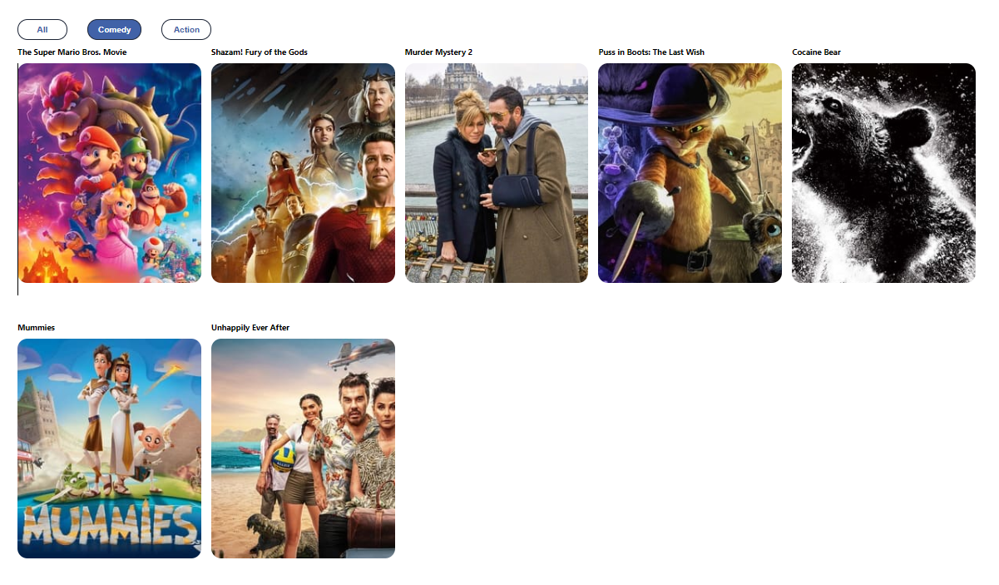

# React Filter Project
## Description
The React Filter Project is a learning project aimed at teaching developers how to make filters with React. The project fetches data from the TMDB API, which shows movies. The filters are created using the React useEffect and useState hooks, allowing users to filter movies by genre. Additionally, the project uses the Framer Motion library to create animations with the filters.

## Installation
To install and run this project, follow these steps:

1. Clone the repository to your local machine.
2. Run npm install to install the necessary dependencies.
3. Run npm start to start the development server.

## Usage
Once the development server is running, open your web browser and go to http://localhost:3000 to access the application. From there, you can use the filters to search for movies by genre.